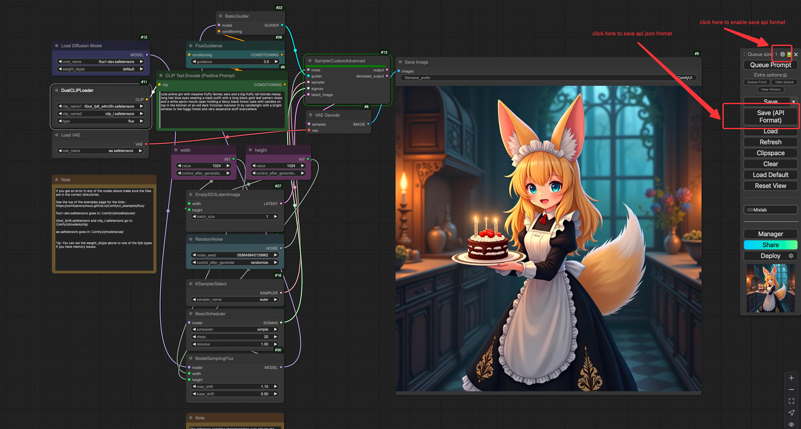

# ComfyUI-server
Due to the incomplete backend API interface provided by ComfyUI, it is very inconvenient to deploy ComfyUI related workflow microservices in one's own application. Therefore, I wrote this project as an enhanced backend implementation solution for ComfyUI.

**Contributions are welcome! Feel free to star, fork, and submit PRs to help improve this project. 😊**

## Features
- Support deploying **any** ComfyUI workflow in a factory-like manner.
- Integrate and schedule multiple Comfyui services.
- Store the generated image in S3.
- Monitor ComfyUI service and notify the client through **webhook** when image generation is complete.
- Automatically clean up excess local input and output image files.
- Record task flow and save error files.

The system architecture diagram is as follows:


## Usage
1. clone this repository
```bash
git clone https://github.com/Poseidon-fan/ComfyUI-server.git
```

2. configure your environment variables

Create `.env` file in ComfyUI-server root folder with the following variables:
```text
COMFYUI_ENDPOINTS = "localhost:8188,localhost:8189"          # comfyui endpoints, separated by commas

AWS_SECRET_ACCESS_KEY = "your_secret_access_key"             # AWS secret access key
AWS_ACCESS_KEY_ID = "your_access_key_id"                     # AWS access key id
S3_BUCKET = "your_S3_bucket_name"                            # S3 bucket name
S3_REGION_NAME = "your_S3_region_name"                       # S3 region

RDB_USERNAME = "root"                                        # Postgres username
RDB_PASSWORD = "123456"                                      # Postgres password
RDB_HOST = "localhost"                                       # Postgres host
RDB_PORT = "5432"                                            # Postgres port
RDB_NAME = "comfy"                                           # Postgres database name
        # webhook callback url
DEFAULT_FAILED_IMAGE_PATH = "../tmp/failed_images"           # fallback local path for error files
SERVICE_PORT = 8000                                          # server port
ROUTE_PREFIX = "/api/v1"                                     # api route prefix
```

3. install [fileCleaner node](https://github.com/Poseidon-fan/ComfyUI-fileCleaner)

make sure your comfyUI has already installed this custom node.

4. run the server
```bash
cd ComfyUI-server
poetry install
poetry shell
cd src
python main.py
```

## How it works
You could refer to the flow chart above to understand the workflow of this project. Here is a brief introduction to the main components:

### interact with ComfyUI
By default, the APi working mode of ComfyUI is:
- The information sent by the user to ComfyUI contains two fields:
  - `prompt`: contains workflow information for ComfyUI
  - `clientId`: request sender's identification

  Once received a prompt, ComfyUI will generate a prompt_id and send back. I call it `comfyui_task_id`.

- You can establish a websocket connection to ComfyUI based on the clientId. ComfyUI will send the processing information for requests with the same clientId.
- The SaveImage and LoadImage nodes native to ComfyUI can only retrieve/output files from local folders.

So, for each `ComfyUIServer`, specify a unique clientId, and use the clientId to establish a websocket connection with ComfyUI.
For the messages sent from the ComfyUI, I manually filtered out the information of task completion and traced back to the results of the task.

### schedule multiple ComfyUI services
Monitor the remaining number of tasks in the current queue of each Comfyui service through the websocket link,
and select the service with the smallest number of tasks to send the prompt.

### Provide external interfaces
I use fastapi, which is a python web framework, to provide external interfaces.
The core code is in `src/api` folder, which contains the following files:
```python
# src/api/__init__.py

class ServiceType(Enum):
    TEXT2IMG = 'text2img'
    IMG2IMG = 'img2img'


class RequestDTO(BaseModel):
    service_type: ServiceType
    id: int
    params: dict

@router.post('')
async def queue_prompt(request_dto: RequestDTO):
    """commit a prompt to the comfyui server"""
    service_func = getattr(Service, request_dto.service_type.value)
    return await service_func(request_dto.id, request_dto.params)
```
The ServiceType enum class contains the service types that can be provided, and the RequestDTO class is used to receive the request parameters. The `queue_prompt` function is the main entry point for the external interface, which will call the corresponding service function according to the service type.

```python
# src/api/service.py
def _get_comfyui_server():
    """schedule the comfyui server with the least queue remaining"""
    return min(comfyui_servers, key=lambda x: x.queue_remaining)


class Service:
    @staticmethod
    async def text2img(client_task_id: int, params: dict) -> ComfyUIRecord:
        comfyui_server = _get_comfyui_server()
        text = params.get('text')
        prompt_str = TEXT2IMG_COMFYUI_PROMPT_TEMPLATE.substitute(text=text)
        prompt_json = json.loads(prompt_str)
        return await comfyui_server.queue_prompt(client_task_id, prompt_json)

    @staticmethod
    async def img2img(client_task_id: int, params: dict) -> ComfyUIRecord:
        comfyui_server = _get_comfyui_server()
        text = params.get('text')
        image_base64 = params.get('image')

        # upload image to comfyui
        image_bytes = base64.b64decode(image_base64)
        resp = await comfyui_server.upload_image(image_bytes)
        image_path = resp['name']
        if resp['subfolder']:
            image_path = f"{resp['subfolder']}/{image_path}"

        # create prompt
        prompt_str = IMG2IMG_COMFYUI_PROMPT_TEMPLATE.substitute(text=text, image=image_path)
        prompt_json = json.loads(prompt_str)
        try:
            return await comfyui_server.queue_prompt(client_task_id, prompt_json)
        finally:
            # clean up the input file after the prompt is queued
            await comfyui_server.clean_local_file(is_input=True, image_path=image_path)
```
The `Service` class contains the service functions that can be provided. The above are two examples.

The workflow templates are stored in `src/workflows`, which can be configured according to your workflow requirements.

### Upload result image to S3
The code could be found in `src/s3`, it's just a basic encapsulation of the aiobotocore library.

### Webhook
In this system setup, a client-side `client_url` needs to be configured in the environment variable,
and every time the client sends a request, it must include the client's `client_task_id`.
When this service detects that ComfyUI has completed a prompt processing information and sent the file to S3 storage,
it will access the `client_url/client_task_id` and include detailed result information in the request body.

### clean local input and output images
Please refer to this custom node of ComfyUI: [https://github.com/Poseidon-fan/ComfyUI-fileCleaner](https://github.com/Poseidon-fan/ComfyUI-fileCleaner)

### record task flow and save error files
I use postgres as rdb to record these information:

| field            | introduction                       |
|------------------|------------------------------------|
| client_task_id   | the task id sent from the client   |
| comfyui_task_id  | the prompt_id generated by ComfyUI |
| s3_key           | key of the s3 object               |
| comfyui_filepath | image path locally                 |

when there's an error when uploading to s3 or webhook, the error file will be saved in the fallback path. Its path is the same as comfy_filepath.

## How to add a new workflow
Here, I take the example of the text production workflow of the flux model in the repository.
1. go to your comfyui and export workflow API:



2. create a new file in `src/workflows` folder, and paste the exported API into it. Replace the parameters you want to configure with $ (python template string format).
3. add an enum member in `src/api/__init__.py` ServiceType class.
4. create a function in `src/api/service.py` Service class, make sure the function name is the same as the enum member you added. And implement the function according to the workflow you exported.

Now you can use the new workflow in your application.

The base request json format is:
```json
{
    "service_type": "service type. example: text2img",
    "params": {
        // based on your workflow
        "text": "prompt text",
        "image": "base64_format "
    },
    "client_task_id": 1  // task id from client
}
```
The immediate response and the webhook request format is:
```json
{
  "comfy_task_id": "d8f9e16e-af8a-4315-9584-5e669bbdf3af",
  "s3_key": "fa39816b-e89f-4702-bce6-24351825e2ae.png",
  "client_task_id": 101,
  "comfy_filepath": "ComfyUI_00157_.png"
}
```
